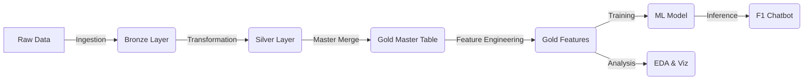

# Formula 1 Dynamics Analysis: End-to-End MLOps Project

A comprehensive Data Engineering & Machine Learning project analyzing the 2024 Formula 1 Season.
This project implements a "Lakehouse" architecture (Bronze/Silver/Gold layers) to process raw data, engineer advanced features, and deploy a predictive Machine Learning model accessible via an interactive Chatbot.

---

## 🏗️ Project Architecture & Workflow

The pipeline is designed as a series of modular Python scripts, moving data from raw ingestion to actionable insights.



### 📂 Data Layers
| Layer | Description | Script |
| :--- | :--- | :--- |
| **Bronze** | Raw Ingestion (Parquet Dump) | `bronze_data_ingestion_1.py` |
| **Silver** | Cleaned & Standardized (Schema Validation) | `bronze_to_silver_2.py` |
| **Gold** | Analytical Master Table (Joined & Enriched) | `silver_to_gold_master_merge_3.py` |
| **Features** | Rolling Averages, Win Rates, Consistency Scores | `feature_engineering_5.py` |

---

## 🚀 Key Components

### 1. Main Pipeline (`pipeline.py`)
Orchestrates the foundational data processing:
-   **Ingestion**: Loads CSVs from `data/f1/` to `data/bronze/`.
-   **Cleaning**: Standardizes column names (snake_case) and fixes missing values.
-   **Merging**: joins Race Results with Qualifying, Circuit, Team, and History data into a single `master_table.parquet`.

### 2. Advanced Analytics Pipeline (`feature_pipeline.py`)
A dedicated pipeline for the "Intelligence" layer:
1.  **Feature Engineering**: Calculates:
    *   **3 & 5 Race Rolling Averages** (Form)
    *   **Season Win/Podium Rates** (Dominance)
    *   **Instability Score** (Reliability/Crash proxy)
    *   **Consistency Score** (Std Dev of finishing positions)
2.  **Advanced EDA**: Generates charts in `imgs/` (Consistency Rankings, Reliability vs Points).
3.  **ML Modeling**: Trains and evaluates the predictive model.

### 3. Machine Learning Baseline (`ml_baseline_7.py`)
*   **Model**: Random Forest Regressor
*   **Goal**: Predict Driver Finishing Position
*   **Performance (Test Set)**:
    *   **MAE**: ~1.5 positions (On average, prediction is off by only 1.5 spots)
    *   **R²**: ~0.89 (High predictive power)
*   **Key Insight**: "Recent Form" (Rolling Avg) is the #1 predictor of future success.
*   **Artifact**: Saves trained model to `data/models/rf_model.joblib`.

### 4. F1 Data Companion Chatbot (`data_bot_8.py`)
An interactive console agent that answers questions about the 2024 season.
*   **Usage**: Run `python scripts/data_bot_8.py`
*   **Capabilities**:
    *   "Who is the most consistent driver?"
    *   "Show me stats for Max Verstappen"
    *   "Who has the worst reliability?"
    *   "Predict position for Lewis Hamilton" (Uses the live ML model)

---

## 🛠️ How to Run

### Prerequisities
-   Python 3.x
-   Libraries: `pandas`, `numpy`, `scikit-learn`, `matplotlib`, `seaborn`, `joblib`, `fastparquet`

### Step-by-Step
1.  **Initialize Data Layer**:
    ```bash
    python scripts/pipeline.py
    ```
    *(Creates Bronze, Silver, and Gold Master Table)*

2.  **Run Analytics & ML**:
    ```bash
    python scripts/feature_pipeline.py
    ```
    *(Generates Features, Plots, and Trains ML Model)*

3.  **Talk to the Bot**:
    ```bash
    python scripts/data_bot_8.py
    ```
    *(Ask questions and get predictions)*

---

## 📊 Visualizations
The project automatically generates insights in the `imgs/` folder, such as:
-   `driver_consistency_2024.png`
-   `feature_importance_rf.png`
-   `reliability_vs_points_2024.png`